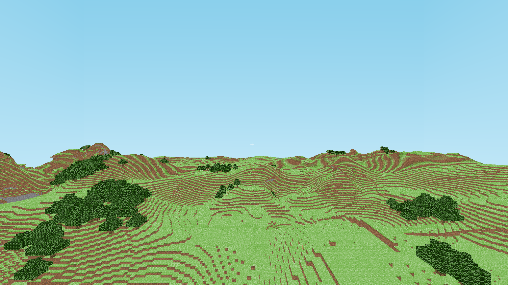

# ft_vox
Minecraft-like voxel world generator in C++ with OpenGL



## Build

### Linux, macOS
```cpp
meson build && ninja -C build
```

## Dependencies

### Common
```
glew
glfw3
FreeType
OpenGL
```

### Linux
```
x11
xi
xrandr
```

# Features
- C++17
- Multithreaded world generation
- Random world with Simplex Noise
- Built from scratch with OpenGL
- Easy UI programming with built-in tools
